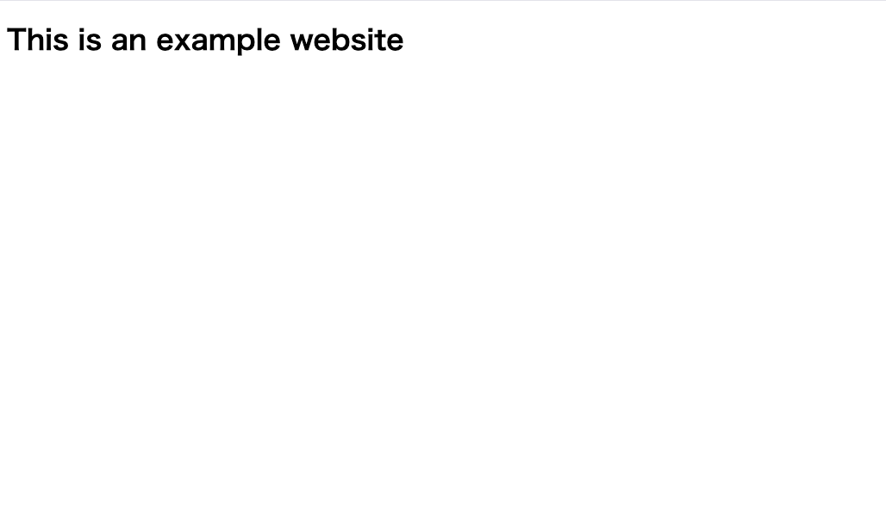
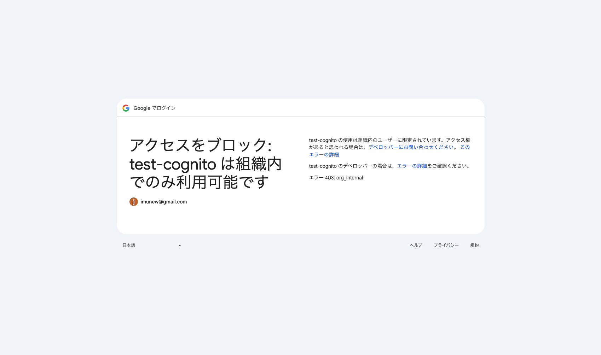

# yields-aws-toolkit
AWS Cognito の認証プロバイダーを使って、特定の Google Workspace のユーザーのみ利用できるようサイトを保護します。

CloudFormation スタックを、AWS CLI + Bun Shell でデプロイし、インフラを構築します。

## 概要
以下の手順で構築できます。

- Google Cloud にて OAuth 2.0 クライアント を作成
    - クライアントID と クライアントシークレット を取得
- Route53でドメインを登録（登録済みのドメインがあれば不要）
- 環境変数ファイルの設定
- コマンド実行

## 詳細な構築手順
### Google Cloud にて OAuth 2.0 クライアント を作成

1. [Google Cloud Console](https://console.cloud.google.com/) にアクセス
2. プロジェクトを選択または新規作成
3. 左メニューから「APIとサービス」→「認証情報」を選択
4. 「認証情報を作成」→「OAuth クライアント ID」をクリック
5. 同意画面の構成を求められた場合は、以下を設定:
    - ユーザータイプ: 「内部」(Google Workspace組織内のみ)
    - アプリ名、サポートメール、デベロッパー連絡先情報を入力
    - スコープは追加不要(デフォルトのまま)
6. 「アプリケーションの種類」で「ウェブ アプリケーション」を選択
7. 名前を入力(例: `My App OAuth Client`)
8. 「承認済みのリダイレクト URI」に以下を追加:
   ```
   https://<your-cognito-domain>.auth.<region>.amazoncognito.com/oauth2/idpresponse
   ```
9. 「作成」をクリック
10. 表示される **クライアントID** と **クライアントシークレット** をコピーして保存

### Route53 にてドメインを登録（登録済みのドメインがあれば不要）

1. [Route 53 コンソール](https://console.aws.amazon.com/route53/) にアクセス
2. 左メニューから「登録済みドメイン」を選択し、「ドメインの登録」をクリック
3. 取得したいドメイン名を入力して検索し、利用可能なドメインを選択して「カートに追加」→「続行」
4. 登録者・管理者・技術者の連絡先情報を入力
    - 「すべての連絡先に同じ情報を使用する」にチェックを入れると一括入力できる
    - プライバシー保護 (WHOIS の個人情報を非公開) は有効化を推奨
5. 自動更新の設定を確認し、「続行」をクリック
6. 内容を確認して「注文を送信」をクリック
    - 登録完了まで数分〜数十分かかる場合がある
    - 完了後、登録したメールアドレスに確認メールが届く
7. 登録完了後、左メニューの「ホストゾーン」に同名のホストゾーンが自動作成されていることを確認する
    - 後の手順 (SSL証明書の DNS 検証) で **ホストゾーン ID** が必要になるため控えておく

### 環境変数ファイルの設定
環境変数ファイル ( `.env` ) にて、以下の値を設定します。

| 環境変数名              | 説明                              | 必須 | デフォルト値                      |
|--------------------|---------------------------------|----|-----------------------------|
| AWS_PROFILE        | AWSプロファイルを指定                    | 任意 | 指定しなかった場合は、デフォルトプロファイルになります |
| AWS_DEFAULT_REGION | AWSリージョンを指定                     | 任意 | ap-northeast-1             |
| STACK_FAMILY       | CloudFormation の各スタックに共通する名称を指定 | 必須 | なし                          |
| CERTIFICATE_DOMAIN | Certificate Manager 認証のドメイン     | 必須 | なし                          |
| HOSTED_ZONE_NAME | ホストゾーンの名前を指定                    | 必須 | なし                          |
| APP_HOST | アプリケーションのホスト名を指定                | 必須 | なし                          |
| USER_POOL_DOMAIN_PREFIX | Cognito ドメインのプレフィックスを指定         | 必須 | なし                          |
| GOOGLE_CLIENT_ID | Google OAuthクライアントのIDを指定        | 必須 | なし                          |
| GOOGLE_CLIENT_SECRET | Google OAuthクライアントのシークレットを指定    | 必須 | なし                          |

以下、設定例です。

```bash
$ cp .env.example .env
$ cat .env
AWS_PROFILE=yields
AWS_DEFAULT_REGION=ap-northeast-1
STACK_FAMILY=example
CERTIFICATE_DOMAIN=example.yields.tech
HOSTED_ZONE_NAME=yields.tech
APP_HOST=example.yields.tech
USER_POOL_DOMAIN_PREFIX=yields-example
GOOGLE_CLIENT_ID=xxxxxxxxxx-xxxxxxxxxx.apps.googleusercontent.com
GOOGLE_CLIENT_SECRET=xxxxxxxxxx-xxxxxxxxxx_xxxxxxxxxx
```

#### 注意
デプロイコマンドを実行すると、作成したリソースのIDなど、上記以外の環境変数を自動で登録します。

自動で登録された環境変数はスタックの削除などで必要ですので、編集・削除しないようにしてください。

### コマンド実行
以下のコマンドで全スタックを一度に作成できます。

```bash
$ bun task deploy:all 
```

下記のように、`All stacks deployed successfully` のメッセージが出力されれば成功です。

```bash
$ bun task deploy:all
$ bun run bin/commander.ts deploy:all

# (中略)

    "Capabilities": [
        "CAPABILITY_IAM"
    ],
    "Tags": [],
    "EnableTerminationProtection": false,
    "DriftInformation": {
        "StackDriftStatus": "NOT_CHECKED"
    }
}

All stacks deployed successfully
```

デプロイが成功したら、`https://${APP_HOST}` にアクセスします。

以下のように、Webページが表示されれば正常です。



尚、他の Google アカウントからアクセスすると、以下のようにエラーページが表示されます。



## 削除
以下のコマンドで全スタックを一度に削除できます。

```bash
$ bun task delete:all 
```

下記のように、`All stacks deleted successfully` のメッセージが出力されれば成功です。

```bash
$ bun task delete:all
$ bun run bin/commander.ts delete:all

# (中略)

[12:59:49.430] INFO (25410): sam delete \
--stack-name example-authenticator \                                                                                                                                                                                                                          
--no-prompts \                                                                                                                                                                                                                                                
--profile yields \                                                                                                                                                                                                                                            
--region us-east-1                                                                                                                                                                                                                                            
        - Deleting S3 object with key 125759101106397d9308a73c5b2e5947
        - Deleting S3 object with key 36f327d093503b349e31461fcd0c19eb.template
        - Deleting Cloudformation stack example-authenticator

Deleted successfully

All stacks deleted successfully
```
